# 📚 Agent测试方法论 - 项目导航

## 🎯 项目简介

这是一个**全面的Agent测试方法论项目**，专门针对Agent系统（特别是具身智能Agent）的测试需求，构建了**科学、实用、可落地**的测试体系。

---

## 📖 文档架构

```
📚 Agent测试方法论文档体系
├── 📖 项目导航 (1个文档)
│   └── 00-项目导航.md              # 本文档，项目导航中心
├── 📚 基础理论层 (3个文档)
│   ├── 01-项目介绍.md         # 项目介绍和背景
│   ├── 02-核心概念.md         # 核心概念和原理
│   └── 03-系统架构.md         # 系统架构设计
├── 🧪 测试方法论层 (3个文档)
│   ├── 04-测试方法论.md # 测试方法论体系
│   ├── 05-质量指标.md     # 质量指标体系
│   └── 06-最佳实践.md      # 最佳实践指南
├── 💻 技术实现层 (3个文档)
│   ├── 07-技术实现指南.md      # 技术实现指南
│   ├── 08-开发工作流程.md         # 开发工作流程
│   └── 09-案例分析.md        # 实际案例研究
└── 📚 附录资料层 (3个文档)
    ├── A-术语表.md             # 专业术语表
    ├── B-参考文献.md            # 参考文献
    └── C-贡献指南.md          # 贡献指南
```

---

## 🧠 基础理论

### 📋 [01-项目介绍.md](./01-项目介绍.md) - 项目介绍
- **页数**: 8页 (~5KB)
- **适用对象**: 所有用户、项目经理
- **核心内容**: 项目背景、技术特色、应用场景

### 📋 [02-核心概念.md](./02-核心概念.md) - 核心概念
- **页数**: 12页 (~10KB)
- **适用对象**: 开发者、研究者
- **核心内容**: Agent概念、具身智能、测试理论

### 📋 [03-系统架构.md](./03-系统架构.md) - 系统架构
- **页数**: 20页 (~15KB)
- **适用对象**: 系统架构师
- **核心内容**: 四层架构、组件设计、技术选型

---

## 🧪 测试方法

### 📋 [04-测试方法论.md](./04-测试方法论.md) - 测试方法论
- **页数**: 15页 (~13KB)
- **适用对象**: 测试工程师、架构师
- **核心内容**: 测试策略、风险驱动、CI/CD集成

### 📋 [05-质量指标.md](./05-质量指标.md) - 质量指标
- **页数**: 20页 (~20KB)
- **适用对象**: 质量工程师、数据分析师
- **核心内容**: 50+指标、评估体系、基准对比

### 📋 [06-最佳实践.md](./06-最佳实践.md) - 最佳实践
- **页数**: 18页 (~17KB)
- **适用对象**: 团队负责人、技术经理
- **核心内容**: 团队协作、项目管理、持续改进

---

## 💻 实现指南

### 📋 [07-技术实现指南.md](./07-技术实现指南.md) - 技术实现
- **页数**: 40页 (~30KB)
- **适用对象**: 开发者、实施工程师
- **核心内容**: 代码实现、集成测试、性能优化

### 📋 [08-开发工作流程.md](./08-开发工作流程.md) - 开发流程
- **页数**: 25页 (~20KB)
- **适用对象**: DevOps工程师、项目经理
- **核心内容**: 开发生命周期、部署运维、监控

### 📋 [09-案例分析.md](./09-案例分析.md) - 案例研究
- **页数**: 30页 (~25KB)
- **适用对象**: 所有技术人员
- **核心内容**: 实际案例、经验总结、最佳实践

---

## 📚 附录资料

### 📋 [A-术语表.md](./A-术语表.md) - 术语表
- **页数**: 15页 (~12KB)
- **适用对象**: 所有用户
- **核心内容**: 专业术语、概念解释

### 📋 [B-参考文献.md](./B-参考文献.md) - 参考文献
- **页数**: 10页 (~8KB)
- **适用对象**: 研究者
- **核心内容**: 学术论文、技术文档

### 📋 [C-贡献指南.md](./C-贡献指南.md) - 贡献指南
- **页数**: 8页 (~6KB)
- **适用对象**: 贡献者
- **核心内容**: 贡献流程、编码规范

---

## 🎯 学习路径

### 🌟 初学者路径 (1-2周)

```mermaid
graph LR
    A[项目导航] --> B[项目介绍]
    B --> C[核心概念]
    C --> D[简单实践]
```



**学习计划**:
- **Week 1**: 00-README.md → 01-项目介绍.md
- **Week 2**: 02-核心概念.md → 实践练习

### 🚀 进阶者路径 (2-4周)

```mermaid
graph LR
    A[系统架构] --> B[测试方法]
    B --> C[质量指标]
    C --> D[最佳实践]
```



**学习计划**:
- **Week 1-2**: 03-系统架构.md → 04-测试方法论.md
- **Week 3-4**: 05-质量指标.md → 06-最佳实践.md

### 🎓 专家路径 (3-6周)

```mermaid
graph LR
    A[技术实现] --> B[开发流程]
    B --> C[案例研究]
    C --> D[深入研究]
```



**学习计划**:
- **Week 1-2**: 07-技术实现指南.md → 08-开发工作流程.md
- **Week 3-4**: 09-案例分析.md → 实际应用
- **Week 5-6**: 深入研究和创新

---

## 🔍 快速导航

### 按问题查找

| 问题 | 推荐文档 |
|------|----------|
| **如何开始？** | 00-README.md → 01-项目介绍.md |
| **什么是Agent？** | 02-核心概念.md |
| **如何测试？** | 04-测试方法论.md |
| **质量指标？** | 05-质量指标.md |
| **最佳实践？** | 06-最佳实践.md |
| **如何实现？** | 07-技术实现指南.md |
| **开发流程？** | 08-开发工作流程.md |
| **案例分析？** | 09-案例分析.md |

### 按角色查找

| 角色 | 推荐文档 |
|------|----------|
| **👨‍💻 开发者** | 02→03→07→04 |
| **🧪 测试工程师** | 02→04→05→06 |
| **🏗️ 架构师** | 01→03→05→07 |
| **👥 项目经理** | 01→06→08→09 |

---

## 📊 项目统计

| 维度 | 数据 |
|------|------|
| **文档总数** | 13个 |
| **总页数** | 258页 |
| **总字数** | ~200KB |
| **代码示例** | 500+ |
| **学习时间** | 20+小时 |

---

## 🚀 快速开始

### 📦 环境准备
```bash
# 克隆项目
git clone https://github.com/your-org/agent-testing.git
cd agent-testing

# 安装依赖
pip install -r requirements.txt
```

### 🧪 运行测试
```bash
# 运行所有测试
pytest tests/ -v --cov=src

# 运行示例
python examples/agent_usage_example.py
```

---

## 🤝 社区支持

- **技术讨论**: [GitHub Discussions](https://github.com/your-org/agent-testing/discussions)
- **问题反馈**: [GitHub Issues](https://github.com/your-org/agent-testing/issues)
- **联系方式**: support@agent-testing.org

---

*文档持续更新，欢迎贡献和反馈*
*最后更新: 2025-11-05*
*版本: v3.0.0*
